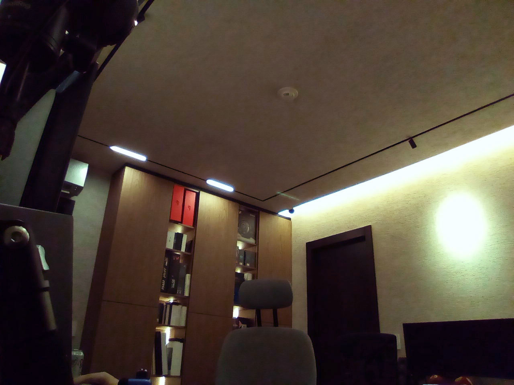

# Working camera for LineageOS on the Amazon Echo Show 5 (1st and 2nd gen) and Echo Show 8 (1st gen)

This repository makes the front camera fully functional on unofficial
LineageOS 18.1 for the Amazon Echo Show 5 (1st gen, 2nd gen) and Echo Show 8 (1st gen) . The
stock ROM port ships no camera stack at all; with this work applied, the
device gets:

| Feature | Status |
| --- | --- |
| Camera enumeration (front, correct orientation) | working |
| Live preview with correct colors | working |
| Still capture (`takePicture`, camera2/CameraX) | working, full 1600x1200 JPEG |
| Video mode sensor timing | working |
| Lens shading correction (factory calibration) | working |
| Auto exposure | working |
| Adaptive auto white balance | working, with a calibrated correction |
| Black level | corrected (the stock tuning left a 30% grey floor) |

## The camera working on an Echo Show 5, 2nd gen

https://github.com/user-attachments/assets/1eb858ac-9401-4b0c-a1cb-05f1e1e1a768

## Actual frame quality

<p>  
 
</p>

Everything here was reverse-engineered against a live device; the complete
investigation, including every dead end, is in
[docs/findings.md](docs/findings.md). It is long, but if you maintain a
MediaTek device port it is probably the most useful file in the repository.

## Why this was hard, in one paragraph

The Echo Show ships an Android 7.1 (API 25) camera stack on an Android 9
era kernel and the LineageOS port runs Android 11 userspace on that
kernel. Nothing agrees with anything: the blobs need symbols Android 11
removed, an older display framework than the ROM ships, a cmdq event
encoding the kernel no longer speaks, and Amazon's kernel struct layouts
rather than upstream MediaTek's. On top of that, the ROM's kernel selected
the 1st gen camera sensor (OV9734) while the 2nd gen device has an OV02B10,
so a sensor driver had to be ported, and all of MediaTek's image tuning
(white balance, black level) is for the wrong sensor. Each of those is
fixed here, layer by layer.

## Supported devices

| Device | Codename | Sensor | Status |
| --- | --- | --- | --- |
| Echo Show 5 (2nd Generation) | `cronos` | OV02B10 | working, verified end to end |
| Echo Show 8 | `crown` | OV9734 | working, verified end to end - apply `patches/0014` for the sensor flip |
| Echo Show 5 | `checkers` | OV9734 | working, community verified - needs the pinned `libdpframework` build the install scripts now select |

On the OV9734 devices apply only the kernel struct patch (0001) and the sensor flip (0014) - their sensor
driver is already in the tree and selected - and **skip** the two color
corrections in step 9, which exist only to undo cronos running an OV02B10
against OV9734 tuning. Three OV9734 bring-ups ran neither and got correct
color, `crown` under natural daylight included, so those devices need no
calibration at all.

**OV9734 devices need `patches/0014` for the sensor flip.** Their driver
selects its mirror setting on `CONFIG_CAMERA_MULTIMODAL`, which is
`default n` and set by no Echo Show defconfig, so the flip Amazon intended
for these devices is never compiled in and the sensor reads out inverted.
`ro.camera.sensor_orientation` cannot correct it. Patch 0014 makes the
vertical flip unconditional, and is photo-confirmed on both `crown` and
`checkers`: upright picture, correct color, no calibration needed; see
[docs/INSTALL.md](docs/INSTALL.md) step 3.

## Prerequisites

- An Echo Show 5 or 8 already running R0rt1z2's unofficial LineageOS
  18.1 port from [amazon-oss/releases](https://github.com/amazon-oss/releases) -
  amonet-unlocked, with TWRP intact. If you cannot boot TWRP, stop: some of
  these steps can brick a device that has no recovery path.
- A Linux host with `adb` and `python3`, and a USB cable. USB is what
  matters: TWRP has no networking, so the flashing steps need it. Network
  adb (`adb connect <ip>:5555`) is convenient for the rest but optional.
- A LineageOS 18.1 build environment (needed to build the
  patched boot image and the patched system libraries). Set up the source
  tree per the amazon-oss instructions; `patches/local-manifest-fixes.xml`
  contains the manifest fixes this work needed.

## Installation

**[docs/INSTALL.md](docs/INSTALL.md) is the complete step-by-step guide** -
every command from a stock LineageOS install to a working, color-calibrated
camera, plus troubleshooting. The overview below is the map; the guide is
the route.

There are three layers. They must all be applied; each fixes failures the
next layer would otherwise hit.

1. **Kernel** (boot image): Amazon struct layouts, the OV02B10/OV9734 driver,
   sensor timing fixes. Requires building and flashing a boot image.
2. **ROM system libraries** (device tree + AOSP patches): camera provider
   declaration, front-camera feature declaration, sensor orientation,
   two AOSP camera fixes. Requires building the ROM (or at minimum the
   affected libraries) with the patches applied.
3. **Vendor blobs and on-device tuning**: the proprietary camera stack
   (fetched from a public firmware dump, never shipped here) and the
   patched private display framework go into the vendor tree *before* the
   build; the `LD_PRELOAD` shim and the two tuning corrections are applied
   to the device afterwards, because they are built against, or patch, what
   is on the device.

### Layer 1: kernel

Three things go into `kernel/amazon/mt8163-4.9`, in order:

1. `patches/0001-imgsensor-use-the-Amazon-struct-layouts-on-all-echo-show.patch`
   (every Echo Show device)
2. `patches/ov02b10_mipi_raw-driver.tar.gz` unpacked into
   `drivers/misc/mediatek/imgsensor/src/mt8163/` - the complete OV02B10
   driver, with all its fixes already included (cronos only)
3. `patches/0004-imgsensor-ov02b10-driver-support.patch` - sensor IDs,
   sensor list entry, defconfig (cronos only)

Do not additionally apply 0007/0008/0010 (already inside the driver
tarball; they document how the fixes were developed), do not apply 0002
(a conflicting alternative to 0001), and do not edit the defconfig by
hand - 0004 sets the verified configuration. 0003 is debug logging only.

Build the boot image (`mka bootimage`), then flash it with
`scripts/flash-boot.sh <adb-serial>`.

**Do not `dd` a plain boot image to the boot partition.** On
amonet-unlocked devices the partition begins with the exploit header and a
relocated copy of the boot header; writing a plain image, or writing it at
a guessed offset, produces a hang at the vendor logo that looks exactly
like a bad kernel. Two devices were bricked learning this. The flash
script implements the correct layout, backs up the partition first, and
verifies byte for byte. `scripts/flash-boot.sh --self-test <adb-serial>`
proves the assembly logic by rebuilding your device's own working boot
partition from its parts and requiring an exact match.

### Layer 2: ROM changes

Apply:

```
patches/0005-camera-device-1.0-cookie-fallback-and-ANativeWindowBuffer-preview.patch
patches/0006-camera-flatten-tolerate-zero-size-String8-from-legacy-HALs.patch
patches/0011-device-tree-camera-enablement.patch
```

0005 and 0006 patch AOSP camera code the tree builds
(`camera.device@1.0-impl`, `libcamera_client`); 0011 carries all the device
tree changes (provider declaration, packages, front-camera feature, sensor
orientation, HAL1 native handle flag).
[patches/README.md](patches/README.md) explains what each change is for.

The blob list also has to be declared and the vendor makefiles regenerated
(`device/amazon/<device>/setup-makefiles.sh`) - appending to
`proprietary-files.txt` alone does nothing, because the build reads the
generated `vendor/amazon/<device>/*.mk`.

### Layer 3: vendor blobs, then on-device tuning

Into the vendor tree, **before** building the ROM:

```sh
scripts/fetch-camera-blobs.sh                    # 45 blobs from the public dump
scripts/install-blobs-to-tree.sh <tree>          # place them at their declared paths
scripts/install-private-dpframework.sh <tree>    # API 25 display framework: private
                                                 #   soname + 3 binary patches
scripts/patch-shim-needed.sh <tree>              # add the shim to the blobs' DT_NEEDED
```

Onto the device, **after** flashing the ROM:

```sh
shims/libcmdqevent/build.sh <serial>         # built against the device's own bionic
scripts/install-cmdq-event-shim.sh <serial>  # cmdq event translation + AWB correction
scripts/patch-awb-d65.sh <serial>            # neutralize the double white balance
scripts/patch-obc-pedestal.sh <serial>       # correct the black level for the OV02B10
adb -s <serial> reboot
```

`scripts/install-camera.sh <serial> <tree>` pushes the vendor-tree blobs,
provider libraries, shim and manifest directly, for iterating without a
full reflash.

The blobs come from the public
[amazon_cronos_dump](https://github.com/el-vertedero/amazon_cronos_dump)
firmware dump. This repository contains no proprietary code; the scripts
fetch, patch, and install it on your own device.

## Verify

From a cold boot, with no manual steps:

```sh
adb shell 'pm list features | grep camera'   # camera.any + camera.front, NO plain "camera"
adb shell 'dumpsys media.camera | grep Orientation'   # 0
adb shell 'logcat -d | grep -cE "startStream fail|deque DISPO fail"'   # 0
```

Open the camera app: live preview, then take a photo - it should produce a
full resolution 1600x1200 JPEG in about a second. In a fully dark room a
photo should be essentially black (that is the black-level fix; without it
you get a grey-cyan haze).

## Color calibration

The MediaTek tuning in the blobs is for the OV9734 sensor, not the OV02B10,
so adaptive white balance lands with an illuminant-dependent bias. The shim
corrects it by rescaling the AWB algorithm's output, interpolated between
two calibrated anchors (daylight and warm LED), keyed on the algorithm's
own blue gain. Four 512-based properties control it, re-read every 64
frames so tuning needs no restart:

```
persist.camera.awbtrim.r        cool (daylight) anchor, red
persist.camera.awbtrim.b        cool anchor, blue
persist.camera.awbtrim.r.warm   warm (2600K) anchor, red
persist.camera.awbtrim.b.warm   warm anchor, blue
```

Defaults are in `shims/libcmdqevent/camera-bringup.rc`, calibrated against
a grey surface on one device. To touch up for your unit: point the camera
at anything grey or white, take snapshots, and adjust in steps of 2 or 3
(the color matrix amplifies a change here several times over in the
rendered image, so small steps):

- image too magenta: lower `.r` (or `.r.warm` under warm light)
- image too green: raise it
- same logic for blue with `.b` / `.b.warm`

## Known limitations

- **Scene-to-scene color variance of roughly +-10%.** The blob's AWB output
  wobbles a few percent between sessions on identical scenes and the color
  matrix amplifies it. Inherent to the closed algorithm.
- **Dim mixed lighting can render greenish.** When the AWB classifier finds
  no recognizable illuminant it falls back to its reference gains, which
  bypass part of the correction. A handler for this state is planned.
- **Low-sun color gradient on aged units.** Direct low sunlight through
  the front glass produces a cyan-to-magenta gradient across the frame (IR
  leakage through the aged IR-cut filter plus internal veiling glare). It
  is not visible in midday diffuse daylight or under artificial light. No
  global correction can fix it, and the front glass cannot be cleaned from
  outside.
- **Single client.** The legacy HAL1 stack allows one camera client at a
  time.

## Safety rules

Learned the hard way; both of these can take the device down completely.

1. **Never SIGKILL or `stop` cameraserver while the ISP is streaming.** It
   leaves the memory management unit pointed at freed buffers and the
   resulting bus violation storm livelocks the entire device - no adb, no
   ping, no watchdog. Use `adb reboot`, or `am force-stop` the camera app
   first and give it two seconds.
2. **Only flash boot images with `scripts/flash-boot.sh`** (see the amonet
   partition layout warning above).

## Repository contents

| Path | What it is |
| --- | --- |
| [docs/INSTALL.md](docs/INSTALL.md) | Step-by-step installation, verification, calibration, troubleshooting |
| [docs/findings.md](docs/findings.md) | The full investigation, in order, with every dead end kept and marked |
| [docs/building.md](docs/building.md) | Getting the LineageOS tree for these devices to actually build |
| [docs/handoff-takepicture.md](docs/handoff-takepicture.md) | Worked example of debugging one bug end to end (the capture stall) |
| [patches/](patches/) | Kernel and AOSP patches, numbered in application order |
| [shims/libcamera_shim/](shims/libcamera_shim/) | Source shim closing the 11-symbol gap between the API 25 blobs and Android 11 |
| [shims/libcmdqevent/](shims/libcmdqevent/) | LD_PRELOAD shim: cmdq event-id translation, AWB output correction, diagnostic tracers |
| [scripts/](scripts/) | Fetching, patching, installing, flashing, calibration |
| [tools/cmdq-trace/](tools/cmdq-trace/) | On-device diagnostic tools (ioctl tracers, ISP register/IRQ probes, sensor register poke) |

## Upstream

This work sits on top of R0rt1z2's LineageOS ports for the MT8163 Amazon
devices, which is what makes any of it possible:

| | |
| --- | --- |
| Releases (flashable ROMs) | [amazon-oss/releases](https://github.com/amazon-oss/releases) |
| Echo Show 5 2nd gen build | [lineage-18.1-cronos-v0.3](https://github.com/amazon-oss/releases/releases/tag/lineage-18.1-cronos-v0.3) |
| Manifests for building | [amazon-oss/local_manifests](https://github.com/amazon-oss/local_manifests) |
| Device tree | [android_device_amazon_cronos](https://github.com/amazon-oss/android_device_amazon_cronos) |
| Common device tree | [android_device_amazon_mt8163-common](https://github.com/amazon-oss/android_device_amazon_mt8163-common) |
| Kernel | [android_kernel_amazon_mt8163](https://github.com/amazon-oss/android_kernel_amazon_mt8163) |
| Maintainer | [R0rt1z2](https://github.com/R0rt1z2) |

The patches here are written against those trees. Nothing in this
repository replaces the port - it adds the camera to it.

## Credit

The `crown` diagnosis by CesarAmores
([writeup](https://github.com/CesarAmores/echo-show-crown-camera-diagnosis))
mapped the HAL1 shim crash chain and established that the stock blobs are
2017-era camera1 code. R0rt1z2 maintains the LineageOS ports these devices
run ([amazon-oss](https://github.com/amazon-oss)) and documented the
original kernel/blob mismatch in
[releases#5](https://github.com/amazon-oss/releases/issues/5). The stock
firmware dump is maintained at
[el-vertedero/amazon_cronos_dump](https://github.com/el-vertedero/amazon_cronos_dump).

## License

Original code (shims, scripts, tools) is MIT. Kernel patches are GPL-2.0;
AOSP patches are Apache-2.0. See [LICENSE](LICENSE). No proprietary
binaries are distributed in this repository.
